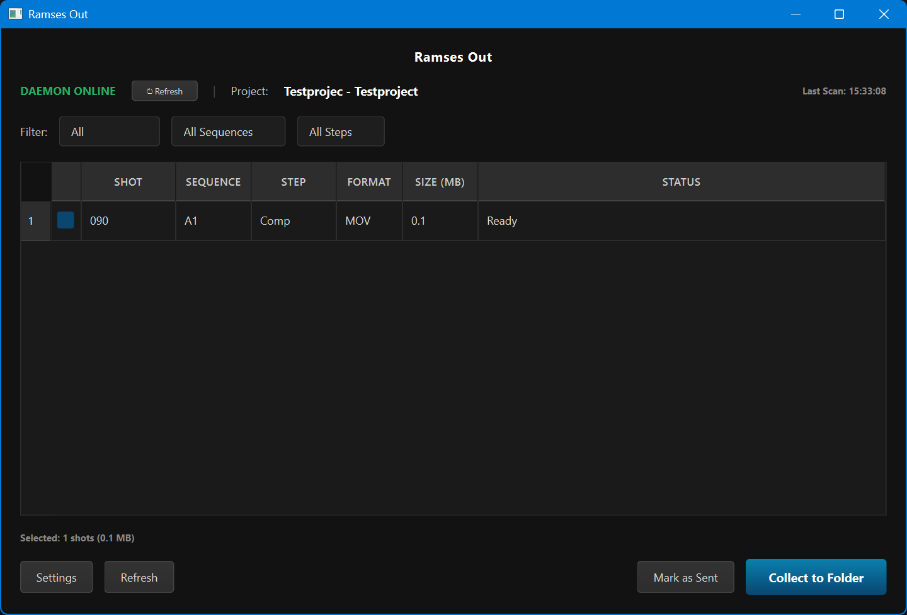

# Ramses Out

A small desktop tool for packaging and tracking preview deliveries in a [Ramses](https://ramses-project.io) pipeline.



---

## What it does

When shots are published in Ramses, the pipeline writes preview files (`.mp4` / `.mov`) into each shot's `_preview` folder. Ramses Out scans those folders, shows you what's new or updated since the last send, and lets you copy a selection to a delivery folder in one click.

It also keeps track of what you've already sent — per file, with timestamps — so you don't accidentally include the same preview twice in a package, and so the rest of the team can see the delivery history without digging through emails.

---

## Workflow

1. Open Ramses Out. It connects to the Ramses daemon automatically and scans the current project.
2. Use the filters (sequence, step, date) to narrow down what you're looking at.
3. Select the shots you want to include in the package.
4. Click **Collect to Folder**. Pick a destination (or use the default configured in Settings). The files are copied and a `shot_list.txt` manifest is written alongside them.
5. The selected shots are marked as sent. Next time you open the tool, they'll show a "Sent" date instead of "Ready", and won't clutter the list.

If you need to mark shots as sent without copying files (e.g. they were delivered another way), use **Mark as Sent** instead.

---

## Status colours

| Colour | Meaning |
|--------|---------|
| Green  | Ready — published preview, not yet sent |
| Yellow | Updated — sent before, but a newer version has been published since |
| Grey   | Sent — already included in a previous delivery |

---

## Requirements

- Python 3.10+
- PySide6
- Ramses daemon running (the Ramses desktop client)

---

## Installation

```bash
pip install pyside6
python -m ramses_out
```

The tool reads Ramses connection settings from the standard Ramses config location (`%APPDATA%/Ramses/Config/` on Windows). No separate setup needed if you already have the Ramses client configured.

---

## Settings

Click **Settings** in the main window to configure:

- **Default collection path** — relative to the project root (e.g. `for_review`). Leave blank to be prompted each time.
- **Ramses client path** — path to the Ramses desktop application.
- **Daemon port** — default is `18185`.

Settings are stored in `~/.ramses/out_config.json`.

---

## Keyboard shortcuts

| Key | Action |
|-----|--------|
| `F5` | Refresh scan |
| `Ctrl+A` | Select all |
| `Ctrl+D` | Deselect all |
| `Space` | Toggle selected row |

---

## Notes

Sent status is tracked via small marker files (`.review_sent_*.txt`) written into each shot's preview folder. This means the tracking data lives with the project files and is shared across the team on a network drive without needing a database. The tool also maintains a personal history log at `~/.ramses/upload_history.log`.

