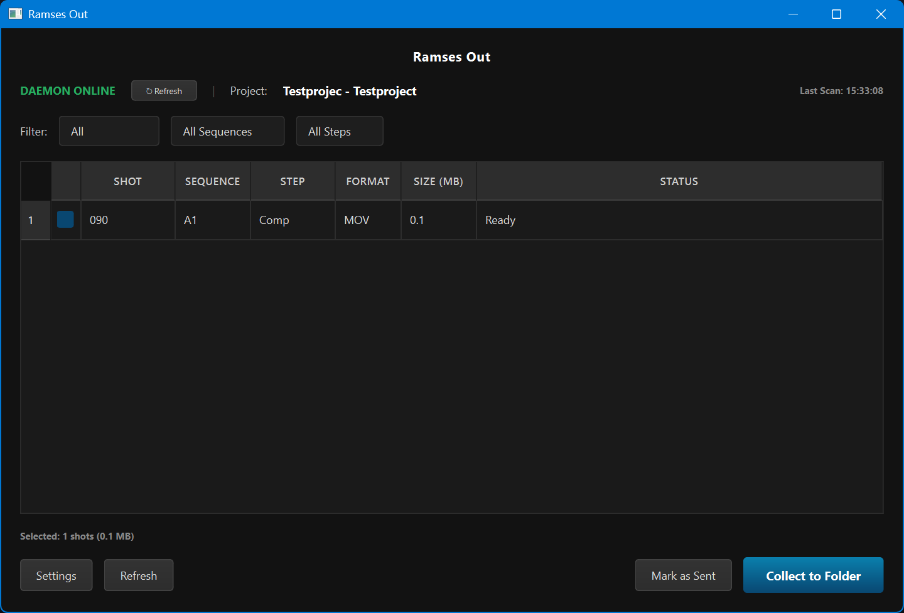

# Ramses Out

A small desktop tool for packaging and tracking preview deliveries in a [Ramses](https://ramses-project.io) pipeline.



---

## What it does

When shots are published in Ramses, the pipeline writes preview files (`.mp4` / `.mov`) into each shot's `_preview` folder. Ramses Out scans those folders, shows you what's new or updated since the last send, and lets you copy a selection to a delivery folder in one click.

It also keeps track of what you've already sent — per file, with timestamps — so you don't accidentally include the same preview twice in a package, and so the rest of the team can see the delivery history without digging through emails.

---

## Workflow

1. Open Ramses Out. It connects to the Ramses daemon automatically and scans the current project.
2. Use the filters (sequence, step, date, **Only OK**) to narrow down what you're looking at.
3. Select the shots you want to include in the package. **Double-click any row to play the preview** in your default video player.
4. Click **Collect to Folder**. Pick a destination (or use the default configured in Settings; the picker starts at the project's export folder). The files are copied and a `shot_list.txt` manifest is written alongside them.
5. Click **Mark as Sent** to record the delivery. Next time you open the tool, those shots will show a "Sent" date instead of "Ready".

If you delivered the files another way and just need to update the tracking without copying anything, use **Mark as Sent** on its own.

---

## The table

| Column | Source |
|--------|--------|
| Thumbnail + Shot | Still image from the shot's `_preview` folder (Ramses-Ingest writes one per plate) |
| Sequence / Step  | Ramses database |
| **State**        | The shot's pipeline status (WIP, OK, …) straight from the Ramses database, in the client's state colour |
| Format / Size    | The preview file on disk |
| Status           | Delivery tracking (see below) |

The **Only OK** filter hides everything whose database state isn't `OK` — use it to make sure a review package only contains approved shots.

## Status colours

| Colour | Meaning |
|--------|---------|
| Green  | Ready — published preview, not yet sent |
| Yellow | Updated — sent before, but a newer version has been published since |
| Grey   | Sent — already included in a previous delivery |

---

## Requirements

- Python 3.10+
- PySide6
- Ramses daemon running (the Ramses desktop client)

---

## Installation

```bash
pip install pyside6
python -m ramses_out
```

The tool reads Ramses connection settings from the standard Ramses config location (`%APPDATA%/Ramses/Config/` on Windows). No separate setup needed if you already have the Ramses client configured.

---

## Settings

Click **Settings** in the main window to configure:

- **Default collection path** — relative to the project root (e.g. `for_review`). Leave blank to be prompted each time.
- **Ramses client path** — path to the Ramses desktop application.
- **Daemon port** — default is `18185`.

Settings are stored in `~/.ramses/out_config.json`.

---

## Keyboard shortcuts

| Key | Action |
|-----|--------|
| `F5` | Refresh scan |
| `Ctrl+A` | Select all |
| `Ctrl+D` | Deselect all |
| `Space` | Toggle selected row |

---

## Notes

Sent status is tracked via small marker files (`.review_sent_*.txt`) written into each shot's preview folder. Each marker names the exact preview file it belongs to (a `File:` line), so marking one file as sent never affects sibling previews in the same folder; older markers without the field keep their folder-wide meaning. The tracking data lives with the project files and is shared across the team on a network drive without needing a database.

The delivery history log lives inside the project at `<project>/_deliveries/upload_history.log`, so the whole team sees the same history. When no project is connected, a personal fallback log at `~/.ramses/upload_history.log` is used.

